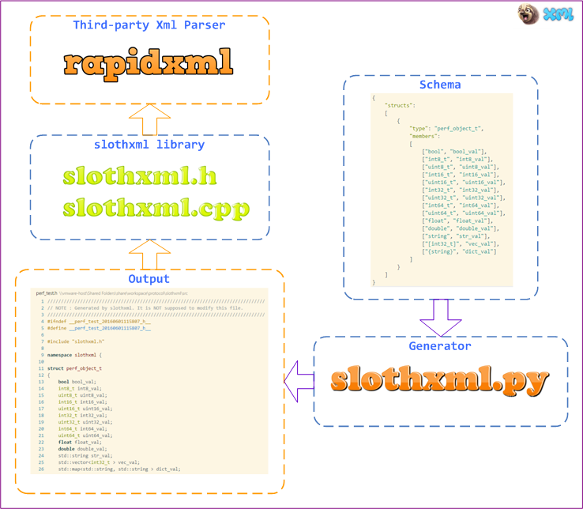

[简体中文](README_ZH.md)

# slothxml - object serialization artifact for lazy man #

`slothxml` is the sister of [slothjson](https://github.com/jobs-github/slothjson), a powerful tool kit used in object serialization and deserialization with **full automation** feature, based on [rapidxml](https://sourceforge.net/projects/rapidxml). 

The following is the design of slothxml: 

## What is slothxml ? ##

Please refer to [slothjson](https://github.com/jobs-github/slothjson)

## Features ##

Please refer to [slothjson](https://github.com/jobs-github/slothjson)

## Usage ##

In the beginning, you need to add the following items to your project:

* `rapidxml`: refer to `include/rapidxml`, the fastest xml parser in the world
* `slothxml`: refer to `include/slothxml.h` and `include/slothxml.cpp`, the library of slothxml

**That's all the dependency** , very easy, isn't it ? ^_^

Then, you need to take a few seconds to know the most important interfaces of slothxml: 

	namespace slothxml
	{
        // encode C++ object to xml string
	    template<typename T>
        bool encode(const T& obj_val, const char * root_name, std::string& xml_val);

        // decode xml string to C++ object
	    template<typename T>
        bool decode(const std::string& xml_val, const char * root_name, T& obj_val);
	}
	
	namespace slothxml
	{
        // encode C++ object to xml string, then dump it to file
	    template<typename T>
        bool dump(const T& obj_val, const char * root_name, const char * path);

	    // load xml string from file, then decode it to C++ object
	    template<typename T>
        bool load(const char * path, const char * root_name, T& obj_val);
	};

Argument `root_name` is used to set the name of xml root:

I believe the interfaces metioned above can meet most of the requirements.

**For example** , write the schema named `fxxx_gfw.json`:  

	{
	    "structs": 
	    [
	        {
	            "type": "fxxx_gfw_t",
	            "members": 
	            [
                    ["bool", "bool_val", "true"],
                    ["int8_t", "int8_val", "'a'"],
	                ["int32_t", "int32_val", "-111111"],
	                ["uint64_t", "uint64_val", "0xffff"],
	                ["double", "double_val", "111111.111111"],
	                ["string", "str_val", "test"],
	                ["[int32_t]", "vec_val"],
	                ["{string}", "dict_val"]
	            ]
	        }
	    ]
	}

Run command line:  

    python generator/slothxml.py -f src/fxxx_gfw.json

It will generate `fxxx_gfw.h` and `fxxx_gfw.cpp`, which you need to add to your project.  
Then you can code like this: 

    slothxml::fxxx_gfw_t obj_val;
    // set the value of "obj_val"
    ......
    // output as string
	std::string xml_val;
	bool rc = slothxml::encode(obj_val, "object", xml_val);
    // output as file
    std::string path = "fxxx_gfw_t.xml";
    bool rc = slothxml::dump(obj_val, "object", path);

If you don't want to serialize all fields, code like this: 

    obj_val.skip_dict_val(); // call "skip_xxx"
The same as deserialize:

    // load from string
	std::string xml_val;
    // set the value of "xml_val"
    ......
    slothxml::fxxx_gfw_t obj_val;
	bool rc = slothxml::decode(xml_val, "object", obj_val);

    // load from file
	std::string path = "fxxx_gfw_t.xml";
    slothxml::fxxx_gfw_t obj_val;
	bool rc = slothxml::load(path, "object", obj_val);

After deserialized, if you need to know **whether a field is in XML or not**, code like this:

    if (obj_val.xml_has_dict_val()) // call "xml_has_xxx()"
    {
         ......
    }

That's all about the usage, simple & stupid, isn't it ?  

## Platforms ##

Please refer to [slothjson](https://github.com/jobs-github/slothjson)

## Details ##

`slothxml` and `slothjson` share the **same design, same schema**. The only difference between them is the name of code generator, one is `slothjson.py`, another is `slothxml.py`.

You can get all details from [here](https://github.com/jobs-github/slothjson). 

## License ##

`slothxml` is licensed under [New BSD License](https://opensource.org/licenses/BSD-3-Clause), a very flexible license to use.

## Author ##

* chengzhuo (jobs, yao050421103@163.com)  

## More ##

- Sister - [slothxml](https://github.com/jobs-github/slothxml)
- High-performance Distributed Storage - [huststore](https://github.com/Qihoo360/huststore)